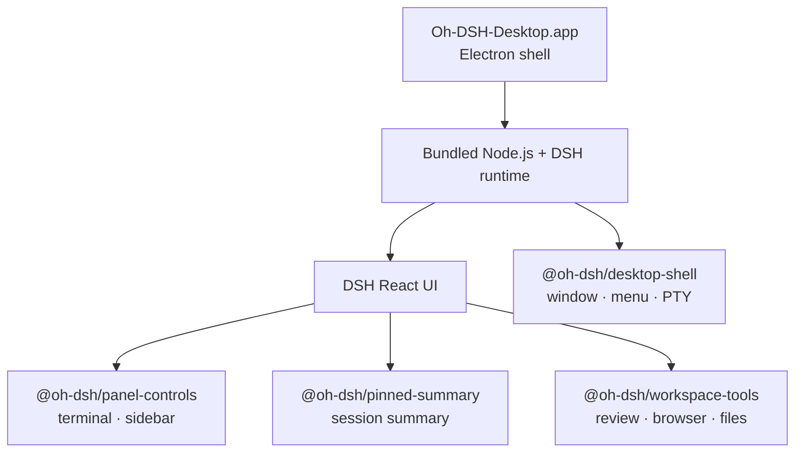

<p align="center">
  <a href="./README.md">简体中文</a> ·
  <strong>English</strong>
</p>

<div align="center">
  
  <h1>Oh-DSH-Desktop</h1>
  <p><strong>DeepSeek Harness, packaged as an installable and extensible desktop workbench.</strong></p>
  <p>
    Keep the DSH React UI, then bring the terminal, workspaces, Git, browser,
    and plugin runtime into one self-contained Electron application.
  </p>
  <p>
    <a href="#quick-start">Quick Start</a> ·
    <a href="#capabilities">Capabilities</a> ·
    <a href="#architecture">Architecture</a> ·
    <a href="#plugin-system">Plugin System</a> ·
    <a href="#development-and-validation">Development</a>
  </p>
</div>

<p align="center">
  
  
  
  
  
</p>

<p align="center">
  
</p>

<p align="center">
  <sub>The DSH interface and workflow stay intact. Desktop capabilities arrive through independent plugins.</sub>
</p>

## What it is

Oh-DSH-Desktop is a desktop distribution of DeepSeek Harness and a collection
of bundle plugins that register with DSH. Models still run in the cloud. The
desktop application owns the interface, local files, terminal, browser,
window integration, and plugin lifecycle.

The project does not rewrite the DSH frontend or require a separate Web
Terminal installation. It packages DSH, Node.js, Electron, and the required
native modules into a macOS application that can start the complete runtime
on its own.

> [!NOTE]
> The current release target is Apple Silicon (arm64). Test builds do not have
> a Developer ID signature or Apple notarization. They are suitable for local
> installation and verification, but not yet for general distribution.

## Capabilities

| Capability | Implementation |
| --- | --- |
| Self-contained desktop build | Electron shell bundles the DSH runtime, Node.js, and native modules |
| Native terminal | First-party PTY host, multiple terminal tabs, and session-level size and font preferences |
| Workspace Review | Changes, diffs, branch switching and creation, commit/push, and background processes |
| Pinned Summary | Half-height summary card that follows the active Session and reserves space in the conversation |
| Embedded Side Panel | Review, Browser, Files, Side chat, and Trajectory share one right-hand tool area |
| Focus mode | The Side Panel can cover Chat completely and returns with Esc |
| Plugin installation | Install a DSH plugin from a folder and retain user plugin order across runtime restarts |
| macOS integration | Hidden title bar, draggable window regions, native menus, file pickers, and external links |

Review lives only inside the Side Panel and does not take a separate toolbar
slot. Opening the Side Panel collapses Pinned Summary automatically. The
bottom Terminal remains independently toggleable.

## Quick start

### Install a test build

Download one of the artifacts from [GitHub Releases](../../releases):

- `Oh-DSH-Desktop-0.1.0-arm64.dmg`
- `Oh-DSH-Desktop-0.1.0-arm64.zip`

Open the DMG and drag `Oh-DSH-Desktop.app` into `Applications`. Because the
test build is not notarized, the first launch may require right-clicking the
application in Finder and choosing **Open**.

### Run from source

Requirements:

- macOS 12 or later
- Apple Silicon
- Node.js 24+
- pnpm 11+
- Xcode Command Line Tools
- A sibling DSH source tree, expected at `../dsh` by default

```sh
pnpm install
pnpm run build
pnpm run stage:dsh
pnpm start
```

Writable DSH state is stored in:

```text
~/Library/Application Support/Oh-DSH-Desktop/dsh
```

Configure the DeepSeek API key from DSH Settings or place it in the `.env`
file under that directory. Credentials are never written into the application
bundle.

## Desktop controls

| Action | Shortcut |
| --- | --- |
| Toggle the DSH sidebar | `⌘B` |
| Toggle the bottom Terminal | `⌘J` |
| Toggle the Side Panel | `⌥⌘B` |
| Open Review | `⌃⇧G` |
| Open Browser | `⌘T` |
| Open Files | `⌘P` |
| Start a Side chat | `⌥⌘S` |
| Leave Side Panel focus mode | `Esc` |

The top toolbar only shows controls that make sense for the current state:

- Pinned Summary is visible while the Side Panel is closed.
- Opening the Side Panel hides Pinned Summary and reveals the expand control.
- Terminal and Side Panel controls remain independently available.

## Architecture



### Bundled plugins

| Plugin | Responsibility |
| --- | --- |
| `@oh-dsh/desktop-shell` | Electron/DSH bridge, PTY WebSocket host, native menus, and desktop capabilities |
| `@oh-dsh/panel-controls` | Multi-tab Terminal, bottom panel, sidebar, font, and height preferences |
| `@oh-dsh/pinned-summary` | Active Session summary and conversation gutter management |
| `@oh-dsh/workspace-tools` | Workspace/Git API, embedded Review, and Side Panel tools |
| `@oh-dsh/desktop` | Root bundle that registers every desktop plugin in a stable order |

`cordis.patch.yml` reuses `dsh-base` and `dsh-web-app`, binds the runtime to a
temporary loopback port, and loads the desktop plugins in dependency order.

## Plugin system

The **DSH → Install Plugin from Folder…** application menu performs the
equivalent of:

```sh
dsh plugin --profile desktop add <plugin-directory>
```

DSH restarts the runtime after installation. Third-party dependencies and
bundle order live in the writable `profiles/desktop/package.json`. Bundled
desktop plugins keep their fixed order, while user plugins retain their own
installation order.

## Security boundaries

- The DSH Web runtime listens only on a random loopback port.
- Browser uses an isolated Electron partition without Node.js or preload
  injection.
- The Files API validates real paths and rejects paths or symbolic links that
  escape the active Workspace.
- File lists, file previews, and PTY messages have explicit count or size
  limits.
- `scripts/stage-dsh.mjs` verifies the Node.js SHA-256 checksum and rejects
  links back into the source tree.
- pnpm's release-age policy stays enabled, with an explicit exclusion only
  for `@deepseek-ai/*`.

## Build the macOS installer

A complete build rebuilds the sibling DSH source tree first:

```sh
pnpm run dist:mac
```

When the DSH build output is already current:

```sh
pnpm run dist:mac:quick
```

Artifacts are written to `release/`:

```text
release/
├── Oh-DSH-Desktop-0.1.0-arm64.dmg
├── Oh-DSH-Desktop-0.1.0-arm64.zip
└── mac-arm64/Oh-DSH-Desktop.app
```

## Development and validation

```sh
pnpm run typecheck
pnpm test
pnpm run check:screenshot
pnpm run build
pnpm run smoke:runtime
pnpm run smoke:app
```

The test suite covers profile initialization, runtime startup, the PTY
protocol, terminal state, Workspace/Git boundaries, file access constraints,
and right-panel layout contracts. The screenshot check also verifies that all
four corners retain a real alpha channel.

### Project layout

```text
.
├── assets/                  # Whale artwork and UI screenshot
├── plugins/
│   ├── desktop-shell/       # Electron bridge and PTY host
│   ├── panel-controls/      # Terminal and panel controls
│   ├── pinned-summary/      # Session summary
│   └── workspace-tools/     # Review, Git, Browser, and Files
├── scripts/                 # Build, staging, smoke, and macOS packaging
├── src/                     # Electron main process, preload, and root bundle
├── tests/                   # Node test runner regression tests
└── cordis.patch.yml         # DSH bundle layer
```

## Commit convention

Commits use the `module: subject` format and include a body and DCO trailer:

```text
workspace: embed review tools

Explain what changed and why.

Signed-off-by: Your Name <you@example.com>
```

Keep every body line within 72 characters. `git commit -s` adds the sign-off
automatically.

## License

[BSD 3-Clause](./LICENSE)
