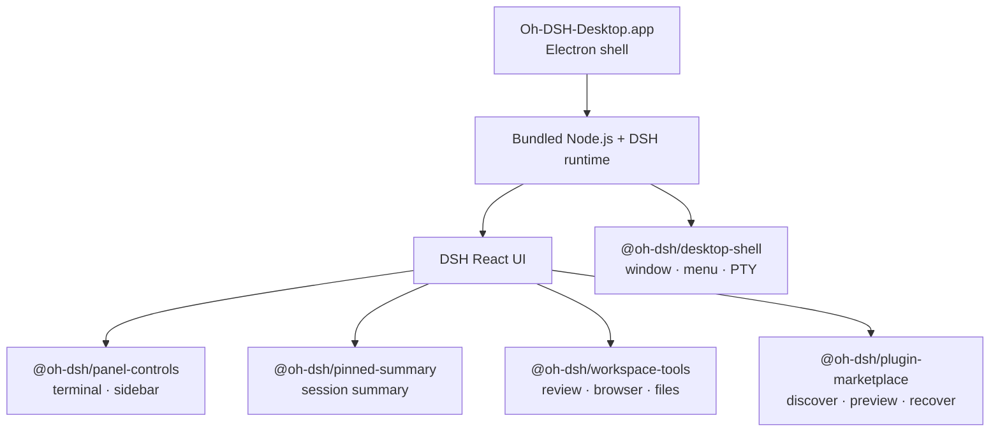

<p align="center">
  <strong>简体中文</strong> ·
  <a href="./README.en.md">English</a>
</p>

<div align="center">
  
  <h1>Oh-DSH-Desktop</h1>
  <p><strong>把 DeepSeek Harness 变成一个真正可安装、可扩展的桌面工作台。</strong></p>
  <p>
    保留 DSH React UI，把本地终端、Workspace、Git、浏览器和插件运行时
    装进一个自包含的 Electron 应用。
  </p>
  <p>
    <a href="#快速开始">快速开始</a> ·
    <a href="#核心能力">核心能力</a> ·
    <a href="#插件市场">插件市场</a> ·
    <a href="#架构">架构</a> ·
    <a href="#插件机制">插件机制</a> ·
    <a href="#开发与验证">开发与验证</a>
  </p>
</div>

<p align="center">
  
  
  
  
  
</p>

<p align="center">
  
</p>

<p align="center">
  <sub>DSH 的界面与工作流不变；桌面能力通过独立 plugin 注入。</sub>
</p>

## 它是什么

Oh-DSH-Desktop 是 DeepSeek Harness 的桌面发行版，同时也是一组可注册给
DSH 的 bundle plugins。模型仍运行在云端；桌面应用负责界面、本地文件、
终端、浏览器、窗口集成和插件生命周期。

项目没有重写 DSH 前端，也不要求额外安装 Web Terminal。它把 DSH、Node.js、
Electron 和所需原生模块一起装进 macOS 应用，安装后即可启动完整 runtime。

> [!NOTE]
> 当前发布目标是 Apple Silicon（arm64）。测试包没有 Developer ID 和
> notarization，适合本机安装验证；正式分发前仍需完成 Apple 签名与公证。

## 核心能力

| 能力 | 实现 |
| --- | --- |
| 自包含桌面发行版 | Electron shell 内置 DSH runtime、Node.js 和原生模块 |
| 原生终端 | 自有 PTY host、多标签 Terminal、会话级尺寸与字体偏好 |
| Workspace Review | Changes、diff、分支切换、创建分支、commit/push 和后台进程 |
| Pinned Summary | 跟随当前 Session 的半高摘要卡片，并为正文自然预留空间 |
| 内嵌 Side Panel | Review、Browser、Files、Side chat、Trajectory 共用右侧工具列 |
| 专注模式 | Side Panel 可展开覆盖 Chat，按 Esc 恢复 |
| 事务化插件市场 | 浏览 `dsh-external`，隔离预览安装、更新、启停和卸载，可应用、放弃或恢复 |
| 对话式插件管理 | Agent 与人类 UI 共用同一个风险、预览、应用和恢复事务内核 |
| 双语插件 UI | 设置中的中文 / English 会实时更新全部内置 Oh-DSH plugins |
| macOS 集成 | 隐藏式标题栏、窗口拖动、原生菜单、文件选择器和外链处理 |

Review 只存在于 Side Panel 内，不占用独立顶部图标。打开 Side Panel 会自动
收起 Pinned Summary；底部 Terminal 可以独立开关。

## 快速开始

### 安装测试包

从 [GitHub Releases](../../releases) 下载：

- `Oh-DSH-Desktop-0.1.0-arm64.dmg`
- `Oh-DSH-Desktop-0.1.0-arm64.zip`

打开 DMG，把 `Oh-DSH-Desktop.app` 拖入 `Applications`。未公证的测试包
首次运行时，可在 Finder 中右键应用并选择“打开”。

### 从源码运行

要求：

- macOS 12 或更高版本
- Apple Silicon
- Node.js 24+
- pnpm 11+
- Xcode Command Line Tools
- 相邻目录中的 DSH 源码，默认路径为 `../dsh`

```sh
pnpm install
pnpm run build
pnpm run stage:dsh
pnpm start
```

DSH 的可写数据位于：

```text
~/Library/Application Support/Oh-DSH-Desktop/dsh
```

DeepSeek API key 可以从 DSH 设置页配置，也可以写入该目录中的 `.env`。
凭证不会写入应用包。

## 桌面交互

| 操作 | 快捷键 |
| --- | --- |
| 切换 DSH 左侧栏 | `⌘B` |
| 切换底部 Terminal | `⌘J` |
| 切换 Side Panel | `⌥⌘B` |
| 打开 Review | `⌃⇧G` |
| 打开 Browser | `⌘T` |
| 打开 Files | `⌘P` |
| 新建 Side chat | `⌥⌘S` |
| 退出 Side Panel 专注模式 | `Esc` |

顶部工具栏只保留当前状态所需的入口：

- Side Panel 关闭时显示 Pinned Summary。
- Side Panel 打开时隐藏 Pinned Summary，显示展开按钮。
- Terminal 和 Side Panel 始终可以独立切换。

## 架构



### 内置 plugins

| Plugin | 职责 |
| --- | --- |
| `@oh-dsh/desktop-shell` | Electron/DSH bridge、PTY WebSocket host、原生菜单与桌面能力 |
| `@oh-dsh/panel-controls` | 多标签 Terminal、底部面板、侧栏、字体与高度偏好 |
| `@oh-dsh/pinned-summary` | 当前 Session 摘要和正文 gutter 管理 |
| `@oh-dsh/workspace-tools` | Workspace/Git API、内嵌 Review 和 Side Panel 工具 |
| `@oh-dsh/plugin-marketplace` | `dsh-external` 目录、隔离候选 Profile、更新检查和回滚 |
| `@oh-dsh/desktop` | 根 bundle，按固定顺序注册所有桌面 plugins |

`cordis.patch.yml` 复用 `dsh-base` 与 `dsh-web-app`，绑定临时 loopback
端口，并按依赖顺序装载桌面 plugins。

## 插件市场

左侧 **插件** 入口读取
[`dsh-external/hub`](https://github.com/dsh-external/hub) 目录，并沿用 DSH
官方的 Profile bundle 与 repository plugin 两种加载机制。市场自身也是一个
`@oh-dsh/plugin-marketplace` plugin，不会替换 DSH Loader。

市场把 `plugin-registry`、`dsh-hub` 等管理项目中经过验证的设计收敛为一条
明确的事务链：

```text
检查来源与精确 commit
        ↓
复制当前 Profile 到隔离候选目录
        ↓
在写入受限的预览窗口中启动 DSH
        ↓
放弃（当前桌面零变化）或应用（保留 previous）
        ↓
必要时 Undo 恢复完整旧 Profile
```

- **全部 / 已安装 / 未安装 / 可更新 / 已停用** 分组保持目录完整，
  不会只显示局部结果。
- 安装与启用是两种状态；已安装插件可以单独预览启用或停用。
- 刷新时比较已安装 commit 与远端 HEAD，并为更新生成新的隔离预览。
- 首次应用会记录来源身份、机制、软件包名、精确 commit 和 manifest
  hash。TOFU 锁在卸载后仍保留；来源身份变化必须重新确认，同一
  commit 内容变化会被直接拒绝。
- 风险分为低、中、高和阻止四级。Repository plugin 应用后属于受信任
  主机代码；桌面内核与市场自身属于受保护插件，不能自我替换。
- 安装脚本默认阻止；只有用户审阅并确认后，才可在写入受限的预览目录中运行。
- 状态明确区分 `candidate`、`current` 和 `previous`。应用失败会自动恢复，
  成功后也可以手动恢复上一份完整 Profile。
- 打开原生设置页时市场自动关闭，避免遮挡设置内容。

Agent 可以在对话中使用 `desktop_plugin_search`、
`desktop_plugin_prepare`、`desktop_plugin_preview` 等工具完成同一流程。
`desktop_plugin_apply` 与 `desktop_plugin_recover` 始终进入 DSH 的人类审批；
它们不会获得第二套 Loader，也不能绕开隔离预览。

私有组织仓库通过 GitHub CLI 认证：

```sh
gh auth login
```

凭证由 `gh auth git-credential` 临时提供，不写入应用配置或命令行参数。

## 插件机制

应用菜单中的 **DSH → 从文件夹安装插件…** 等价于：

```sh
dsh plugin --profile desktop add <plugin-directory>
```

安装后 DSH runtime 自动重启。第三方依赖和 bundle 顺序保存在可写的
`profiles/desktop/package.json` 中；内置 plugins 会保持固定顺序，用户
plugins 保留自己的安装顺序。

所有内置客户端插件都注入 DSH 官方 `locale` 服务并注册 `zh` / `en`
词典。设置页切换语言后，Terminal、Pinned Summary、Workspace tools 和
插件市场会在当前窗口内立即更新，不需要重启 runtime。

## 安全边界

- DSH Web runtime 只监听随机 loopback 端口。
- Browser 使用独立 Electron partition，禁用 Node.js 和 preload 注入。
- Files API 会校验 realpath，拒绝越过当前 Workspace 的路径和符号链接。
- 文件列表、文件预览和 PTY 消息都有明确的数量或大小上限。
- `scripts/stage-dsh.mjs` 校验 Node.js SHA-256，并拒绝指回源码目录的链接。
- pnpm 的 release-age 策略保持启用，只对 `@deepseek-ai/*` 做显式排除。
- 市场从精确 Git commit 构建候选 Profile；预览写入受 macOS Seatbelt
  限制，应用前不会触碰当前桌面 Profile。
- Agent 管理通道只监听随机 loopback 端口。一次性凭据在 Host plugin
  挂载后立即从环境移除，并且从不传入预览 Runtime。

## 生成 macOS 安装包

完整构建会先重建相邻 DSH：

```sh
pnpm run dist:mac
```

DSH 构建产物已经是最新状态时：

```sh
pnpm run dist:mac:quick
```

产物位于 `release/`：

```text
release/
├── Oh-DSH-Desktop-0.1.0-arm64.dmg
├── Oh-DSH-Desktop-0.1.0-arm64.zip
└── mac-arm64/Oh-DSH-Desktop.app
```

## 开发与验证

```sh
pnpm run typecheck
pnpm test
pnpm run check:screenshot
pnpm run build
pnpm run smoke:runtime
pnpm run smoke:app
```

测试覆盖 profile 初始化、runtime 启动、PTY 协议、终端状态、Workspace/Git
边界、文件访问约束和右侧面板布局契约。截图检查还会确认 UI 图片的四个
圆角保留真实的 alpha 透明通道。

### 项目结构

```text
.
├── assets/                  # 鲸鱼图标与 UI 截图
├── plugins/
│   ├── desktop-shell/       # Electron bridge 与 PTY host
│   ├── panel-controls/      # Terminal 和面板控制
│   ├── pinned-summary/      # Session 摘要
│   ├── plugin-marketplace/  # 目录、隔离预览、更新与恢复
│   ├── shared/              # 内置 plugins 共用的 locale 契约
│   └── workspace-tools/     # Review、Git、Browser 与 Files
├── scripts/                 # 构建、stage、smoke 和 macOS 打包
├── src/                     # Electron 主进程、preload 与根 bundle
├── tests/                   # Node test runner 回归测试
└── cordis.patch.yml         # DSH bundle layer
```

## 提交约定

提交使用 `module: subject` 格式，并包含正文和 DCO：

```text
workspace: embed review tools

Explain what changed and why.

Signed-off-by: Your Name <you@example.com>
```

正文每行不超过 72 个字符。可以使用 `git commit -s` 自动添加签名。

## License

[BSD 3-Clause](./LICENSE)
